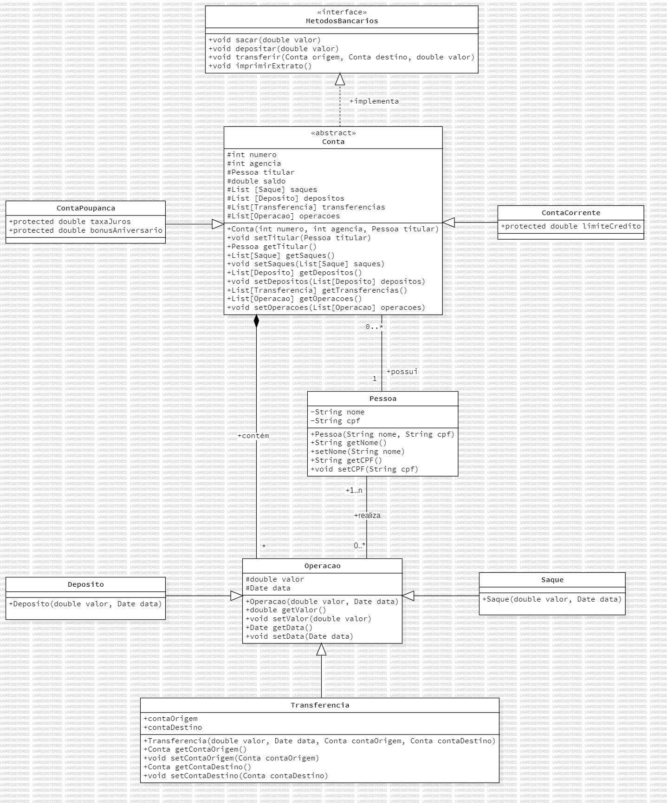

# 🏦 Vai Nu Bank

Um sistema de cadastro de contas bancárias em Java.

## 📚 Tabela de Conteúdos

- [🏦Vai Nu Bank](#-vai-nu-bank)
    - [📚 Tabela de Conteúdos](#-tabela-de-conteúdos)
    - [📋 Descrição](#-descrição)
        - [🚀 Funcionalidades](#-funcionalidades)
        - [📸 Prévia](#-prévia)
    - [⚙️ Construção](#️-construção)
        - [💻 Tecnologias](#-tecnologias)
        - [🛠️ Ferramentas](#️-ferramentas)
        - [📌 Versão](#-versão)
    - [✏️ Aprendizado](#️-aprendizado)
    - [✒️ Autores](#️-autores)
    - [🎁 Agradecimentos](#-agradecimentos)
    - [📨 Contato](#-contato)

## 📋 Descrição

Este é um projeto de um sistema de criação e controle de contas bancárias.
Esse projeto foi lançado como o desafio 01 do módulo 02 do curso de back-end do "Vai na Web". 
Sua principal proposta era colocar os conhecimento de programação orientada a objetos com a linguagem Java. 
O roteiro a ser seguido foi apresentado na plataforma das aulas.

### 🚀 Funcionalidades

As funcionalidades disponíveis para os usuários estão listadas abaixo:

- Cadastro, exclusão e edição de informações das contas
- Utilização de métodos bancários
- Visualização de lasses encapsuladas de acordo com seus tipos e utilidadades
- Organização de pacotes pelas funcionalidades
- Visualização de todas as contas
- Busca de conta pelo número de identificação e de agência

### 📸 Prévia

  

## ⚙️ Construção

Resumo geral dos recursos utilizados na construção do projeto.

### 💻 Tecnologias

Tecnologias utilizadas na construção do projeto:

### 🛠️ Ferramentas

Ferramentas utilizadas na construção do projeto:

### 📌 Versão

Utilizei o Git para o controle de versão.

Versão atual: 1.0 (primeira versão)

## ✏️ Aprendizado

Ao fazer esse projeto, aprendi a:

- Criar e manipular classes e objetos em Java
- Utilizar métodos e atributos estáticos
- Aplicar encapsulamento e visibilidade de atributos e métodos
- Utilizar herança e polimorfismo
- Utilizar interfaces e classes abstratas
- Organizar classes em pacotes
- Utilizar coleções de listas como ArrayList e List
- Fixar o uso de métodos de entrada e saída de dados
- Utilizar estruturas de repetição e condicionais
- Criar e manipular classes de exceção

## ✒️ Autores

* **Milton Salgado Leandro** - *Todo o Projeto* - [GitHub](https://github.com/milton-salgado)

## 🎁 Agradecimentos

* Agradeço ao instrutor Samuel Silverio e ao facilitador João Pedro Belo pelo auxílio no meu processo de aprendizagem e apoio na construção do projeto.
* Agradeço também a você, visitante, por visualizar o meu projeto!

## 📨 Contato

